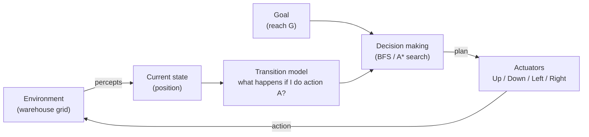

# Goal-Based Agent: Warehouse Navigation

Laboratory exercise: *Constructing a Goal-Based Agent using a Large Language Model*.

An autonomous warehouse vehicle must find a collision-free path from the loading bay (`S`) to the dispatch area (`G`) while avoiding shelving (`#`). This repository contains a goal-based agent that solves the problem with **Breadth-First Search (BFS)**, plus an **A\*** variant for comparison, and a set of unit tests.

```
#####################
#S....#............G#
#.##....##########..#
#....##.............#
#.######.###.#.###..#
#........#..........#
#####################
```

## How to run

Requires Python 3.8 or later. No external libraries are needed.

```bash
python warehouse_agent.py            # solve with BFS (default)
python warehouse_agent.py --astar    # solve with A*
python -m unittest -v                # run the tests
```

### Output (BFS)

```
Path found: 20 moves, 59 nodes expanded.

Action sequence:
Right, Right, Right, Down, Right, Right, Right, Up, Right, Right, Right,
Right, Right, Right, Right, Right, Right, Right, Right, Right

Map with path marked '*':
#####################
#S***.#************G#
#.##****##########..#
#....##.............#
#.######.###.#.###..#
#........#..........#
#####################

Goal reached successfully.
```

The vehicle dips down one row to pass the shelf at column 6, then travels straight along the top aisle to the goal. A\* finds a path of the same length (20 moves) but expands only **23** nodes instead of 59.

## Files

| File | Purpose |
|---|---|
| `warehouse_agent.py` | Environment, search algorithms (BFS and A\*) and the goal-based agent |
| `test_warehouse_agent.py` | Unit tests: valid path, no collisions, optimality, no-path case |
| `README.md` | This report: answers to all lab tasks |

---

## Task 1: Understanding the Problem

**1. What is the environment?**
A 7 × 21 grid representing the warehouse floor. Each cell is either free space (`.`), an obstacle/shelf (`#`), the start (`S`) or the goal (`G`). The environment is *fully observable* (the whole map is known), *deterministic* (a move always has the same effect), *static* (shelves don't move), *discrete* (finite cells and actions) and *single-agent*.

**2. What is the goal of the agent?**
To reach cell `G` (row 1, column 19) from `S` (row 1, column 1) without entering any obstacle cell, ideally by the shortest route.

**3. What actions are available?**
Up, Down, Left and Right, each moving the vehicle exactly one square. An action is only legal if the destination cell is inside the map and is not `#`.

**4. What information must the agent maintain?**
- its current position (state);
- the goal position;
- the map, so that it can predict the result of an action (the transition model);
- during search: the *frontier* (positions waiting to be explored), the *explored set* (positions already visited, to avoid loops), and a *parent link* for each position so the final path can be reconstructed;
- the resulting *plan*: the sequence of actions still to execute.

**5. Why is this a goal-based agent rather than a simple reflex agent?**
A simple reflex agent chooses an action using only the current percept, with condition-action rules such as "if the cell to the right is free, move right". Such an agent has no notion of where it is trying to go, so in this map it would walk into dead ends (for example, the left side of rows 3 to 5) or loop forever. A goal-based agent has an *explicit goal* and uses a model of the world to *look ahead*, asking "what happens if I do this action, and does it bring me closer to G?". It searches over sequences of actions before acting, and it can tell when the goal has been achieved or that no path exists.

### Think About It: a warehouse twice as large

Doubling each dimension gives about 4× the cells (≈ 600). BFS is still perfectly adequate at that size: it is complete and optimal, and the run takes milliseconds. Difficulties appear as warehouses grow much larger or more realistic:

- **Time and memory:** BFS explores in all directions equally and stores every visited cell, so cost grows with the area of the map. **A\*** with the Manhattan-distance heuristic focuses the search towards the goal. Even on this small map it expands 23 nodes rather than 59.
- **Dynamic obstacles:** people, pallets or other vehicles move, so a precomputed plan can become invalid. The agent must monitor its percepts and **re-plan** (for example with D\* Lite).
- **Multiple vehicles:** paths must avoid collisions in time as well as in space (multi-agent path finding).
- **Non-uniform costs:** turning, congested aisles or one-way lanes make step costs unequal; BFS is then no longer optimal and Uniform-Cost Search or A\* is needed.
- **Uncertainty:** sensor noise or wheel slip means the environment is no longer fully observable or deterministic.

---

## Task 2: Designing the Agent

| Component | In this problem |
|---|---|
| **Environment** | `Warehouse` class: the 2-D grid with free cells and shelves |
| **Current state** | The vehicle's position `(row, col)`, starting at `S` |
| **Goal** | Position of `G`; goal test is `state == goal` |
| **Actions** | Up, Down, Left, Right (`ACTIONS` dictionary); `legal_actions()` removes moves into shelves or off the map |
| **Transition model** | `result(pos, action)`: the position after a move |
| **Decision-making component** | Search (`bfs()` or `astar()`) that produces a plan; `GoalBasedAgent` then executes the plan one action at a time |

### Block diagram



A plain-text version for reports:

```
            +------------------------------------------------+
            |                    AGENT                       |
 percepts   |  [Current state] --> [Transition model]        |
 ---------->|        |                    |                  |
            |        v                    v                  |
            |      [Goal] -------> [Search: BFS / A*]        |
            |                             |  plan            |
            |                             v                  |
 <----------|                       [Action selector]        |
  action    +------------------------------------------------+
     ^                                    |
     |           ENVIRONMENT (warehouse grid)
     +------------------------------------+
```

---

## Task 3: Prompt Engineering

### Prompt used

> Write a well-documented Python program implementing a goal-based agent for the warehouse navigation problem shown above (map included). The program should: represent the warehouse as a two-dimensional grid; determine a collision-free path from S to G; avoid all obstacles; print either the path found or a suitable message if no path exists; explain the search algorithm that has been chosen and why it is appropriate. Structure the code so that the environment, state, goal, actions and decision-making component are clearly separated, and include unit tests.

### Testing

The program was run with `python warehouse_agent.py`, and the tests with `python -m unittest -v`. All 6 tests pass. The tests check that:

- `S` and `G` are found at the correct positions;
- every step moves exactly one square and never enters a shelf;
- BFS and A\* find paths of the same (shortest) length;
- A\* expands no more nodes than BFS;
- the agent actually reaches the goal;
- an unreachable goal produces the message *"No collision-free path exists from S to G."*

### Answers

**1. Did the LLM generate a working program on the first attempt?**
Yes. Because the prompt was a detailed specification (data representation, required outputs, the no-path case, and an explicit request for tests), the first version ran correctly and all tests passed.

**2. How could the prompt be improved?**
- Give the exact map in a code block so it is copied character-for-character.
- State the move rules precisely (4-directional, unit cost, no diagonals).
- Ask for a shortest path explicitly, since "a path" allows non-optimal answers.
- Ask for specific test cases, including an unreachable goal.
- Specify the output format (coordinates, action list, map with the path drawn).
- Ask for a comparison between two algorithms, to make the choice justifiable.

**3. What search algorithm did the LLM choose?**
**Breadth-First Search**, with A\* provided as an alternative.

**4. Why did the LLM select this algorithm?**
BFS is the textbook choice for shortest paths on an unweighted grid. Every move costs 1, so BFS is guaranteed to be *complete* (it finds a path if one exists) and *optimal* (the first path found is a shortest one). The map is small, so its memory cost is irrelevant, and it is simple to implement and explain. It also appears very frequently in programming tutorials for grid/maze problems, which makes it the most likely pattern for an LLM to reproduce. A\* gives the same optimal answer more efficiently and is the better choice for larger warehouses.

---

## Reflection: strengths and limitations of LLM-assisted development

**Strengths:** fast generation of correct, well-structured, documented code for a well-known problem; good explanations of algorithm choice; quick generation of tests and alternative implementations.

**Limitations:** output quality depends heavily on the prompt; LLMs can produce code that looks right but contains subtle bugs (such as an off-by-one in grid indexing or a missing explored set causing infinite loops), so **every program must be run and tested**; the LLM tends to choose the most common textbook solution rather than the one best suited to a real system; and the human remains responsible for understanding, validating and justifying the design.
